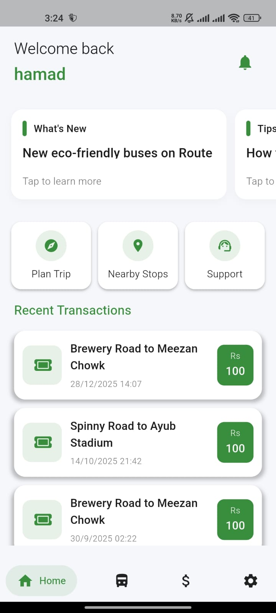
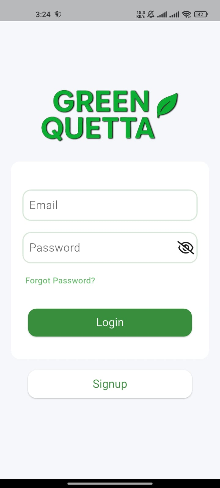
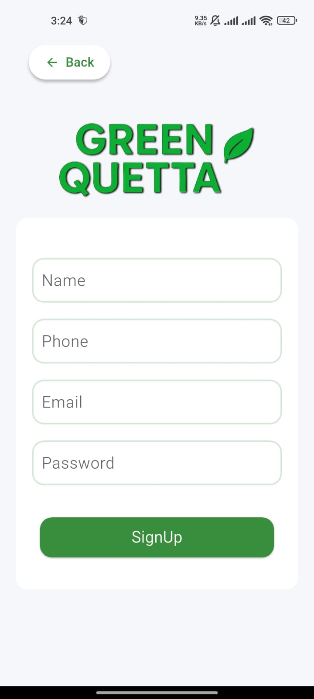
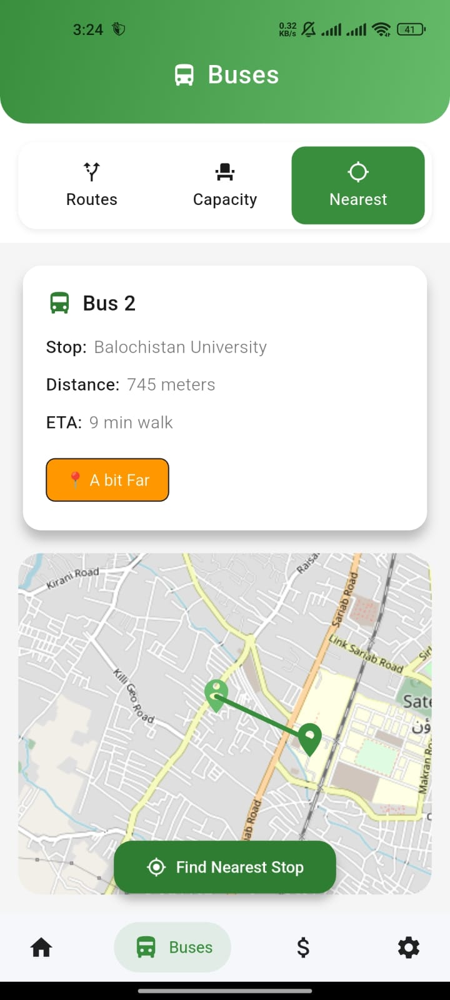
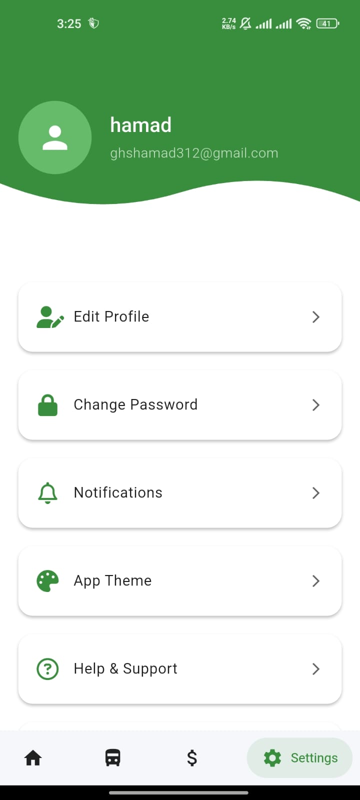
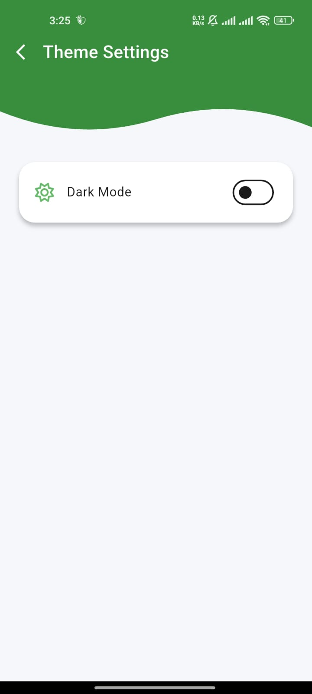

# 🚌 Green Bus App

<div align="center">

  
  
  
  

  <p align="center">
    <b>A smart, eco-friendly mobile application for efficient public transportation planning.</b>
    <br />
    <a href="#-screenshots">View Screenshots</a>
    ·
    <a href="https://github.com/ghshamad/green-bus-app/issues">Report Bug</a>
  </p>
</div>

---

## 📖 Table of Contents
- [📍 Overview](#-overview)
- [✨ Key Features](#-key-features)
- [🔧 Tech Stack](#-tech-stack)
- [📸 Screenshots](#-screenshots)
- [🚀 Getting Started](#-getting-started)
- [🤝 Contributing](#-contributing)

---

## 🌟 Overview

**Green Bus App** is designed to modernize the daily commute. By integrating real-time location services with a robust backend, the app solves common public transport hurdles such as uncertainty in bus timings, crowded stops, and cash-only transactions.

It combines **user convenience**, a **clean UI**, and **powerful backend integrations** to deliver a seamless commuting experience.

---

## ✨ Key Features

| Feature | Description |
| :--- | :--- |
| 🗺️ **Live Map & Routes** | Real-time tracking of bus locations and detailed route visualization. |
| 📍 **Smart Stop Detection** | Automatically detects and suggests the nearest bus stops to your location. |
| 💳 **Digital Wallet** | Secure ticket purchasing with a complete transaction history log. |
| 📶 **Live Capacity** | Real-time updates on bus crowding levels before you board. |
| 🔐 **Secure Auth** | Robust user authentication and profile management via Firebase. |
| ⚙️ **Customizable** | Full control over app settings, themes, and notifications. |

---

## 🔧 Tech Stack

This project leverages a modern mobile development stack for performance and scalability.

| Technology | Badge | Purpose |
| :--- | :--- | :--- |
| **Flutter** |  | Cross-platform UI Framework |
| **Dart** |  | Primary Programming Language |
| **Firebase Auth** |  | User Authentication |
| **Cloud Firestore** |  | Real-time NoSQL Database |
| **Flutter Maps** |  | Mapping & Geolocation |
| **Provider** |  | Application State Management |

---

## 📸 Screenshots

<div align="center">
  
  <h3>📱 User Interface</h3>

  | **Dashboard & Navigation** | **Authentication** |
  |:---:|:---:|
  |  <br/> *Home Dashboard* |  <br/> *Secure Login* |
  
  | **Registration** | **Map Visualization** |
  |:---:|:---:|
  |  <br/> *New User Registration* |  <br/> *Route Planning* |

  | **Route Details** | **Nearest Stop** |
  |:---:|:---:|
  |  <br/> *Detailed Route View* |  <br/> *Proximity Detection* |

  | **Transactions** | **summary** |
  |:---:|:---:|
  |  <br/> *Purchase Ticket* |  <br/> *Transaction Log* |

</div>

<details>
<summary>⚙️ <b>Click to view Settings & Profile Screens</b></summary>
<br>
<div align="center">
  <table>
    <tr>
      <td></td>
      <td></td>
      <td></td>
      <td></td>
    </tr>
  </table>
</div>
</details>


## 🚀 Getting Started

Follow these steps to set up the project locally.

### 📦 Prerequisites

* [Flutter SDK](https://flutter.dev/docs/get-started/install)
* [Git](https://git-scm.com/downloads)
* Active Firebase Project (for `google-services.json`)

### 🛠 Installation

1.  **Clone the repository**
    ```bash
    git clone [https://github.com/ghshamad/green-bus-app.git](https://github.com/ghshamad/green-bus-app.git)
    cd green-bus-app
    ```

2.  **Install dependencies**
    ```bash
    flutter pub get
    ```

3.  **Firebase Configuration**
    * Download `google-services.json` from your Firebase Console.
    * Place it in `android/app/`.

4.  **Run the App**
    ```bash
    flutter run
    ```

---

## 🤝 Contributing

Contributions are welcome! Please feel free to submit a Pull Request.

1.  Fork the project
2.  Create your Feature Branch (`git checkout -b feature/AmazingFeature`)
3.  Commit your changes (`git commit -m 'Add some AmazingFeature'`)
4.  Push to the Branch (`git push origin feature/AmazingFeature`)
5.  Open a Pull Request

---

<div align="center">
  
  **Made with ❤️ by [Hamad Ali Shah](https://github.com/ghshamad)**
  
</div>