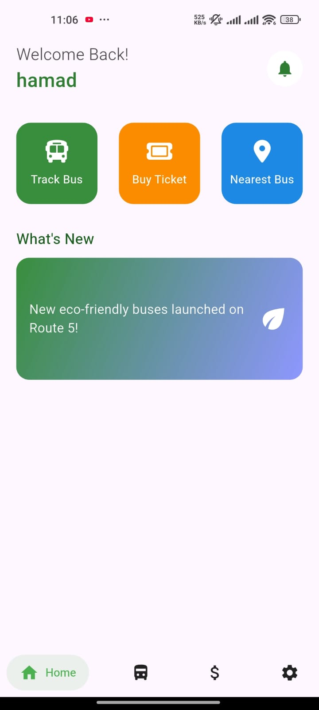
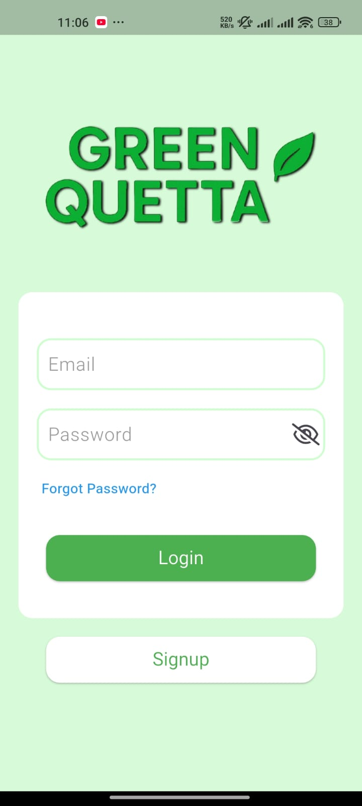
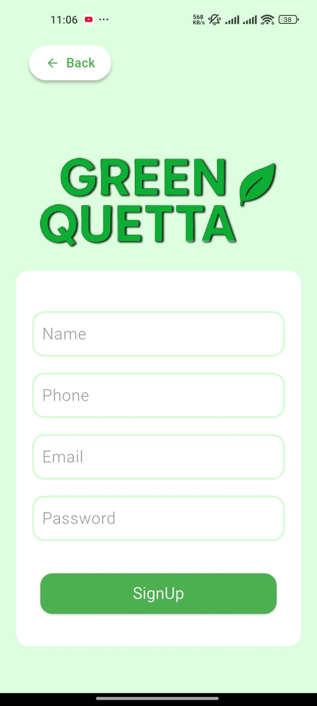
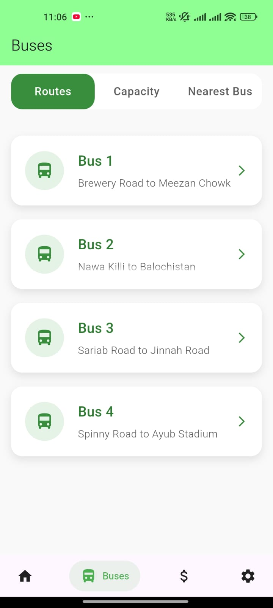
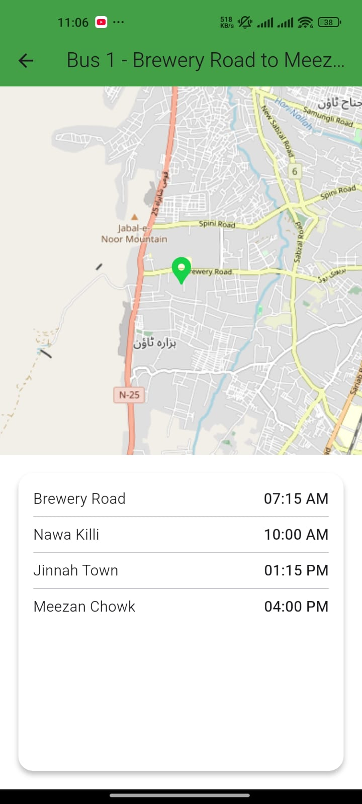
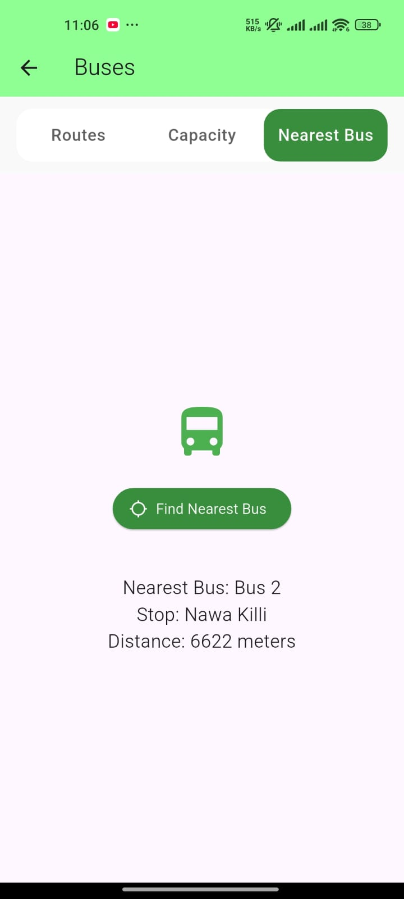
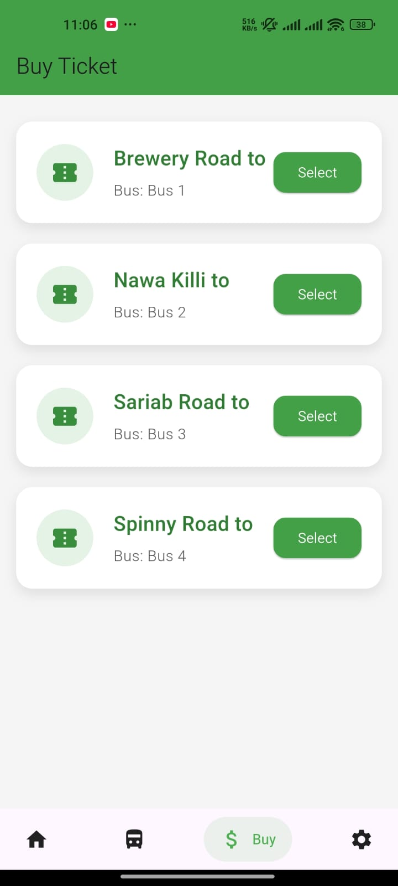
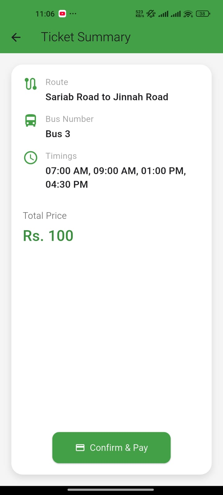
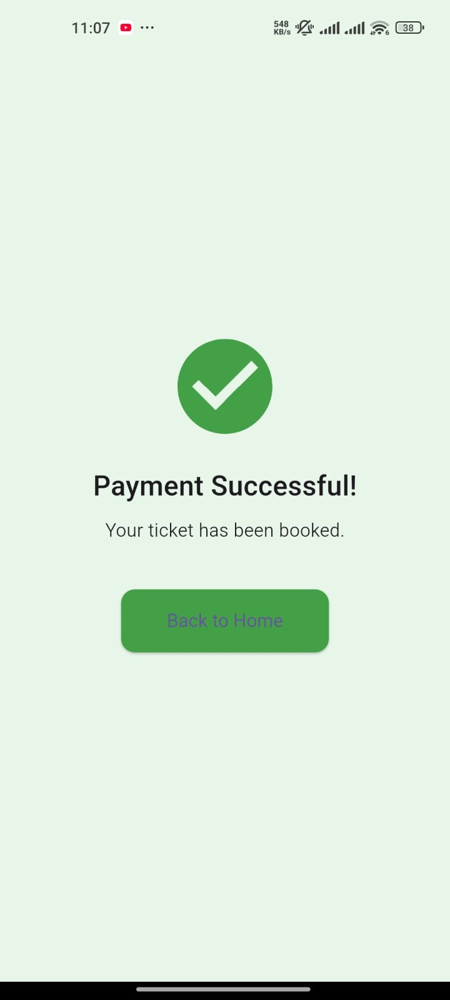
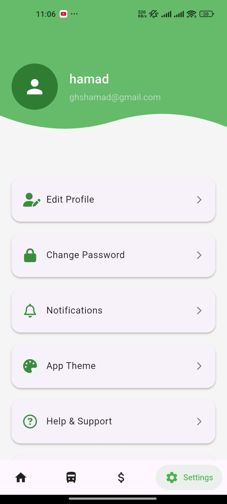

# 🚌 Green Bus App

[](https://flutter.dev/)
[](https://firebase.google.com/)
[](https://opensource.org/licenses/MIT)

A smart, eco-friendly mobile application for public transportation. Built using **Flutter**, integrated with **Firebase Authentication**, **Cloud Firestore**, and **Flutter Maps**, this app empowers users to plan their commutes more efficiently.

---

## 🌟 Overview

**Green Bus App** addresses the common problems of public transportation by offering:

- Real-time bus location & routes  
- Nearby bus stop detection  
- Digital transactions with history  
- Live bus capacity display  
- Account and settings management  

It combines user convenience, clean UI, and powerful backend integrations to deliver a robust commuting solution.

---

## 🔧 Tech Stack

| Technology        | Purpose                          |
|------------------|----------------------------------|
| Flutter           | UI framework                    |
| Dart              | Programming language            |
| Firebase Auth     | User authentication             |
| Cloud Firestore   | Real-time NoSQL database        |
| Flutter Maps API  | Map and location services       |
| Provider          | State management                |

---

## ✨ Features

- 🗺 **Bus Routes & Live Map**  
- 📍 **Nearest Bus Stop Detection**  
- 💳 **Transactions**  
- 👤 **User Authentication & Management**  
- ⚙️ **App Settings**  
- 📶 **Bus Capacity Display**  
- 🧠 **Provider State Management**  

---

## 📸 Screenshots

### 🏠 Home Screen  


### 🔐 Login Screen  


### 📝 Sign Up  


### 🗺️ Bus Routes with Map  
  


### 📍 Nearest Stop  


### 💳 Transactions  
  
  


### ⚙️ Settings  


---

## 🎥 Demo Video

[▶️ Watch Demo on YouTube](https://youtube.com/shorts/oliI5HO8isY?si=NF1Afs2LusV4jrhd)

---

## 🚀 Getting Started

### 📦 Prerequisites

- Flutter SDK installed  
- Firebase project created  
- Android/iOS emulator or physical device  

### 🛠 Installation

```bash
git clone https://github.com/ghshamad/green-bus-app.git
cd green-bus-app
flutter pub get
